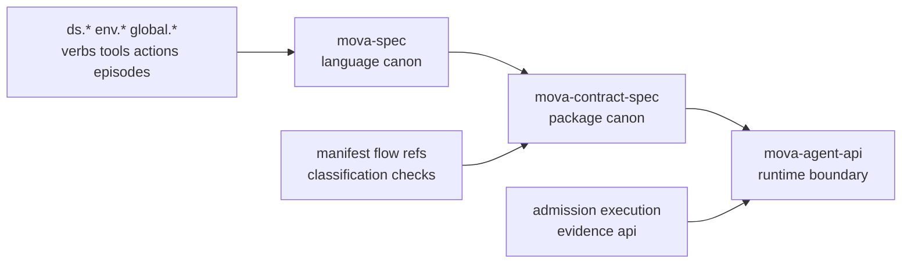

# MOVA Spec 7.0.0

MOVA Spec is the canonical language repository for MOVA.

It defines what is valid:

- `ds.*` JSON schemas
- `env.*` envelopes
- `global.*` semantic catalogs
- verbs, tools, and `action_signature`
- episode and security vocabulary

It does not define:

- contract package assembly
- runtime execution
- orchestration
- deployment
- admission gates

If you need package canon, use `mova-contract-spec`.
If you need runtime or execution boundary behavior, use `mova-agent-api`.

## Positioning

MOVA is a contract language for machine-operable agreements.
This repository is the language layer only.

The core invariant is simple:

`mova-spec` says what a valid MOVA artifact looks like.

Nothing in this repository grants execution authority.
Nothing here decides runtime transitions.
Nothing here replaces package canon.

## Repository Boundaries

| Repository | Owns | Does not own |
| --- | --- | --- |
| `mova-spec` | Language validity: schemas, envelopes, catalogs, verbs, action semantics, episodes, security vocabulary | Package layout, execution behavior, runtime APIs |
| `mova-contract-spec` | Contract package canon: how MOVA language artifacts are assembled into a portable contract package | Core language semantics, runtime execution |
| `mova-agent-api` | Runtime and execution boundary: admission, execution, evidence, API surface | Core language canon, package canon |

## Core Concepts

| Concept | Meaning | Canonical home |
| --- | --- | --- |
| `ds.*` | Data structures and validation rules | `schemas/` |
| `env.*` | Typed speech-acts over data | `schemas/` |
| `global.*` | Shared semantic catalogs | `global/` |
| `verb` | What kind of operation is intended | `docs/concepts/mova_global_and_verbs.md` |
| `tool` | By which channel or execution medium an operation happens | `docs/concepts/mova_global_and_verbs.md` |
| `action_signature` | Primary action primitive: `(verb_id, tool_id, target_kind?)` | `reference/action_signature_cheatsheet.md` |
| `episode` | Structured record of work or security-relevant activity | `docs/concepts/mova_core.md` |

### Action Is The Main Primitive

Since MOVA 6.0.0, the primary operational primitive is:

```text
action_signature := (verb_id, tool_id, target_kind?)
```

Rules:

- `verb_id` identifies the operation type.
- `tool_id` identifies the execution channel.
- `tool_id = 0` is the canonical tool-less action.
- `target_kind` is optional and narrows matching.
- Policy matching priority is `action_signature` > `verb_id` > `tool_id`.

This is the key concept an agent should rely on when generating or validating contract logic.

## Layer Model



## Repository Structure

```text
mova-spec/
├── README.md
├── CONTRIBUTING.md
├── schemas/
│   ├── ds.*.schema.json
│   └── env.*.schema.json
├── global/
│   ├── global.episode_type_catalog_v1.json
│   ├── global.layers_and_namespaces_v1.json
│   ├── global.layers_and_namespaces_v2.json
│   ├── global.security_catalog_v1.json
│   └── global.text_channel_catalog_v1.json
├── reference/
│   ├── contract-composition-guide.md
│   ├── action_signature_cheatsheet.md
│   ├── security_profile_patterns.md
│   └── api-governance-examples.md
├── docs/
│   ├── README.md
│   ├── concepts/
│   ├── evolution/
│   ├── inventory/
│   └── archive/
├── examples/
│   ├── minimal/
│   ├── catalogs/
│   ├── envelopes/
│   └── api/
├── bin/
└── tools/
```

## Quick Start For Humans

```bash
git clone https://github.com/mova-compact/mova-spec
cd mova-spec
npm ci
npm test
```

Recommended reading order:

1. `README.md`
2. `reference/contract-composition-guide.md`
3. `reference/action_signature_cheatsheet.md`
4. `docs/concepts/mova_core.md`
5. `docs/concepts/mova_layers_and_namespaces.md`
6. `examples/`

Validate a document:

```bash
node bin/mova-validate.mjs \
  --schema https://mova.dev/schemas/env.instruction_profile_publish_v1.schema.json \
  examples/envelopes/env.instruction_profile_publish_v1.example.json
```

## Quick Start For LLM Agents / Agent Skill

Use this repository as the single source of truth for language-level questions only.

1. Resolve whether the user is asking about language validity, package composition, or runtime behavior.
2. Stay in `mova-spec` only if the question is about valid shapes, names, catalogs, envelopes, verbs, action semantics, or episodes.
3. Read `reference/contract-composition-guide.md` before generating a contract-like structure.
4. Treat `action_signature` as the primary action unit.
5. Use `global.layers_and_namespaces_v2.json` as the current layered model.
6. Do not invent package files, runtime APIs, or execution gates from this repo alone.
7. When package layout is needed, hand off to `mova-contract-spec`.
8. When runtime behavior is needed, hand off to `mova-agent-api`.

## Reference Guides

- [Contract Composition Guide](reference/contract-composition-guide.md)
- [Action Signature Cheatsheet](reference/action_signature_cheatsheet.md)
- [Security Profile Patterns](reference/security_profile_patterns.md)
- [API Governance Examples](reference/api-governance-examples.md)
- [Documentation Index](docs/README.md)

## Examples

- `examples/minimal/` contains minimal, valid language artifacts.
- `examples/catalogs/` contains catalog examples.
- `examples/envelopes/` contains envelope examples.
- `examples/api/` contains API-oriented governance and security examples.

## Versioning

- Canonical repository version: `7.0.0`
- Schemas use JSON Schema draft `2020-12`
- Breaking schema changes require new ids such as `*_v2`
- `global.layers_and_namespaces_v2.json` supersedes `v1`
- Historical material is retained under `docs/archive/`

## Contributing

See [CONTRIBUTING.md](CONTRIBUTING.md).

The short rule is:

- keep `mova-spec` language-only
- preserve stable ids and boundaries
- validate schemas and examples before proposing changes

## License

Apache-2.0
