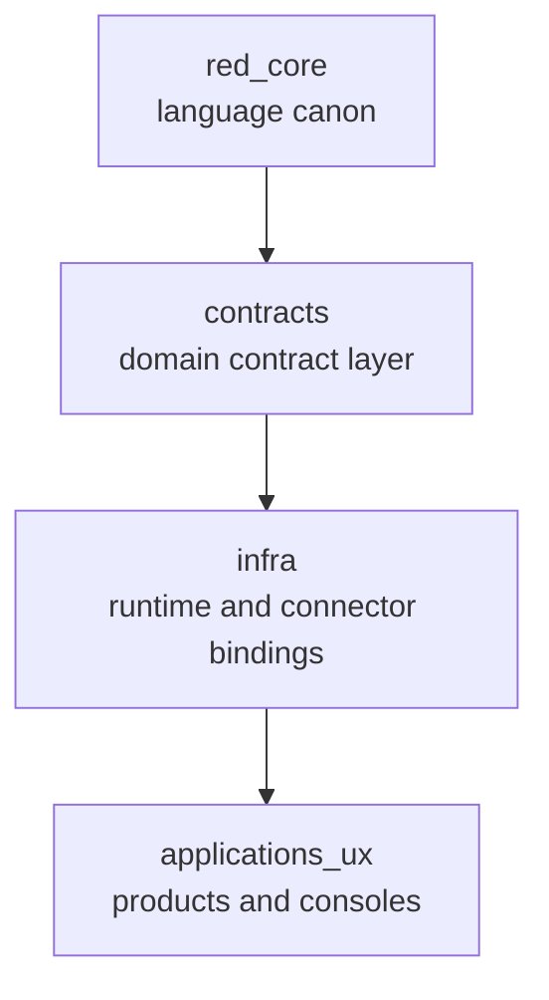

# MOVA Layers And Namespaces

This document explains the current layered model of MOVA.

The canonical machine-readable source is `global/global.layers_and_namespaces_v2.json`.

## Layer Diagram

## Layer Responsibilities

### `red_core`

Owns:

- `ds.*`
- `env.*`
- `global.*`
- verbs, tools, actions
- episode semantics

Does not own:

- domain package structure
- runtime behavior

### `contracts`

Owns:

- domain contracts built from MOVA language primitives
- package-level assembly in the separate `mova-contract-spec` repository

### `infra`

Owns:

- runtime bindings
- connector bindings
- vendor-specific execution surfaces

### `applications_ux`

Owns:

- user-facing products
- consoles
- developer tools

## Namespace Rule

Reserved red-core prefixes stay reserved.

Examples:

- `ds.mova_*`
- `ds.mova4_*`
- `ds.security_*`
- `ds.runtime_core_*`
- `ds.connector_core_*`

Contracts must use domain prefixes.
Infra must use runtime or connector prefixes.

## Short Evolution Note

- older materials used `skills` as a broad layer term
- current canon uses `contracts`
- `v2` of the layers catalog records that migration explicitly

## Practical Rule

If an artifact changes language validity, it belongs here.
If it changes package layout, it belongs in `mova-contract-spec`.
If it changes execution or API behavior, it belongs in `mova-agent-api`.
