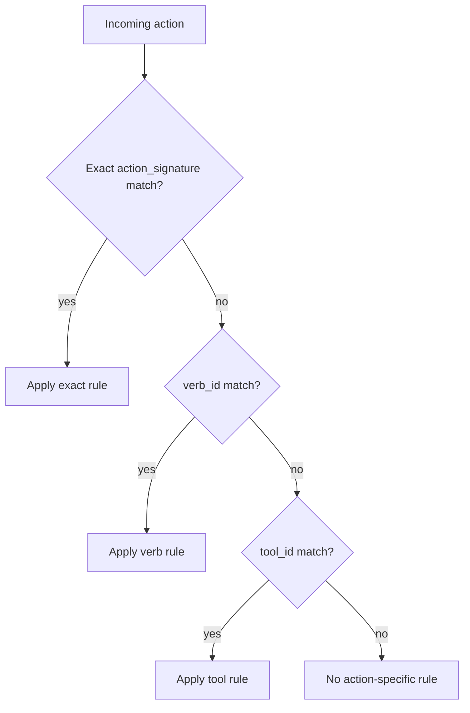

# Action Signature Cheatsheet

`action_signature` is the canonical action primitive in MOVA.

## Definition

```text
action_signature := (verb_id, tool_id, target_kind?)
```

Fields:

- `verb_id`: operation type
- `tool_id`: execution channel
- `target_kind`: optional target class

## Canonical Rules

- `tool_id = 0` means tool-less action
- `tool_id` is not optional semantically when an action is known
- `target_kind` is optional but recommended for fine-grained policy
- action identity is the tuple, not a free-text label

## Matching Priority



Priority order:

1. `action_signature`
2. `verb_id`
3. `tool_id`

If multiple rules match at the same level, stricter effect wins:

`deny > transform > warn > log_only > allow`

## Common Patterns

| Intent | Rule shape |
| --- | --- |
| Block one dangerous API call | `verb_id + tool_id + target_kind` |
| Deny all deletes | `verb_id` only |
| Log all traffic through one connector | `tool_id` only |
| Allow reasoning without tools | `tool_id = 0` |

## Examples

Tool-less analysis:

```json
{
  "verb_id": "analyze",
  "tool_id": 0
}
```

Analysis through retrieval on documents:

```json
{
  "verb_id": "analyze",
  "tool_id": 12003,
  "target_kind": "document"
}
```

Policy target:

```json
{
  "kind": "action",
  "verb_id": "route",
  "tool_id": 31001,
  "target_kind": "external_api_request"
}
```

## Recommended Authoring Heuristics

- Use exact matching for irreversible or security-sensitive actions.
- Use `verb_id` matching for broad governance.
- Use `tool_id` matching for connector-wide logging or restrictions.
- Prefer stable numeric or strongly governed tool ids from dictionaries.
- Do not encode policy identity in human-readable labels.

## Anti-Patterns

- Treating missing `tool_id` as tool-less
- Creating dictionary tables of all valid `(verb, tool)` pairs
- Using labels as policy keys
- Using runtime endpoint names instead of governed `tool_id`

## Reference Files

- `examples/minimal/action_signature.example.json`
- `examples/minimal/action_signature.with_tool.example.json`
- `docs/concepts/mova_security_layer.md`
