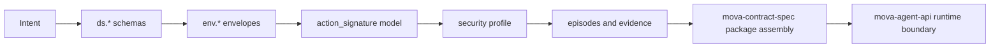

# Contract Composition Guide

This guide explains how to compose a valid MOVA contract at the language level.

Important boundary:

- `mova-spec` tells you which language artifacts must exist and how they relate.
- `mova-contract-spec` tells you how those artifacts are assembled into a full contract package.

Use this guide when you need the right language ingredients before package assembly.

## Composition Recipe

### 1. Define the data structures

Start from `ds.*` schemas.

Identify:

- the business objects you need
- the evidence objects you need
- the episode objects you need

Rule:

- every meaningful object should have an explicit schema or reuse an existing one

### 2. Choose the operation vocabulary

Define the intended verb for each operation.

Examples:

- `create`
- `update`
- `route`
- `record`
- `publish`

If the operation is domain-specific but still language-compatible, keep the domain semantics outside the core verb itself.

### 3. Model the action space with `action_signature`

For every operation that matters for policy, audit, or runtime evidence, define the expected action form:

```text
action_signature := (verb_id, tool_id, target_kind?)
```

Rules:

- use `tool_id = 0` for tool-less actions
- include `target_kind` when it affects governance
- use `action_signature` as the most specific policy key

### 4. Define envelopes

Use `env.*` schemas to express speech-acts over the data.

Each envelope should answer:

- what verb is being expressed
- which roles are involved
- which payload schema is carried
- which metadata is required at the boundary

### 5. Attach shared semantics through `global.*`

Use the relevant catalogs:

- `global.episode_type_catalog_v1.json`
- `global.security_catalog_v1.json`
- `global.layers_and_namespaces_v2.json`
- `global.text_channel_catalog_v1.json`

Do not treat `global.*` as runtime authority.
It is semantic reference, not execution control.

### 6. Define security intent

If the contract can trigger guarded behavior, define an instruction profile.

At minimum:

- identify the scope in `applies_to`
- define rules
- express action-specific constraints with `target.kind = "action"`
- prefer exact `verb_id` + `tool_id` combinations when you need deterministic control

### 7. Define the evidence model

Decide what episodes will be recorded.

Every meaningful execution or security event should be representable as:

- a valid input envelope
- a valid action signature
- a valid episode output

### 8. Validate examples early

Before package assembly, create examples for:

- one minimal valid artifact
- one envelope
- one policy profile
- one episode

This catches ambiguity before runtime work starts.

## Contract Lifecycle



## Minimal Checklist

- The data shape exists as `ds.*`.
- The speech-act exists as `env.*`.
- The operation is expressible as a `verb_id`.
- The governed action is expressible as `action_signature`.
- The episode can record what happened.
- The semantic catalogs are reused instead of duplicated.
- The package details are left to `mova-contract-spec`.

## Anti-Patterns

- Defining runtime endpoints in `mova-spec`
- Defining package file trees in `mova-spec`
- Treating `global.*` as authorization logic
- Omitting `tool_id` when the action is tool-less
- Using vague free text instead of structured rule targets

## Where To Go Next

- For package assembly: `mova-contract-spec`
- For runtime admission and execution: `mova-agent-api`
- For action matching details: [action_signature_cheatsheet.md](action_signature_cheatsheet.md)
